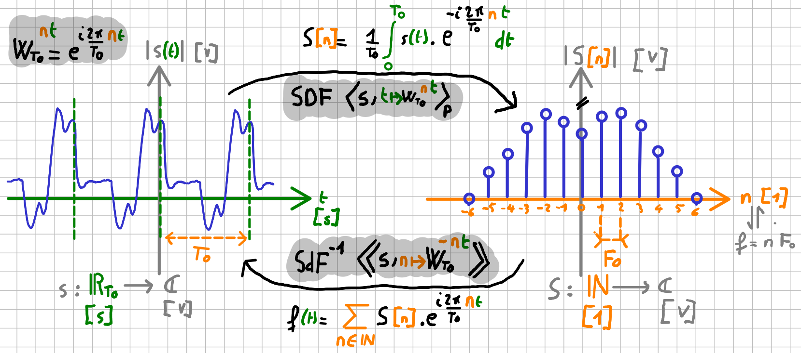
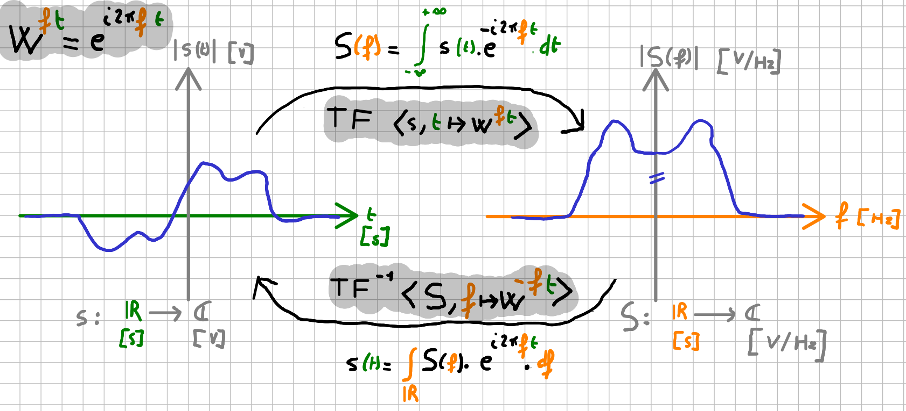
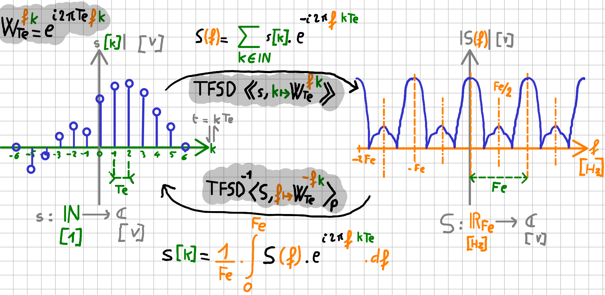
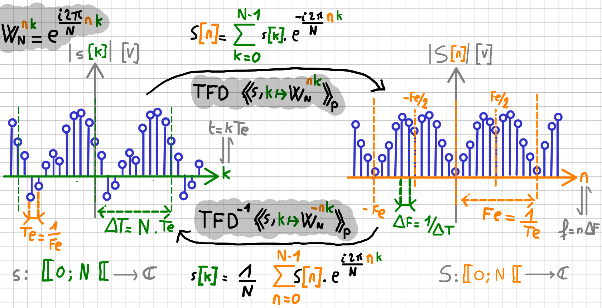

# Signal continu (2IMACS)
---

[Moodle 2IMACS](https://moodle.insa-toulouse.fr/course/view.php?id=708) | [Poly](https://moodle.insa-toulouse.fr/mod/resource/view.php?id=24741) | [Guide de TD](https://nbviewer.org/github/balaise31/Signal/tree/master/continu/td/README.ipynb) | [Guide de TP](https://nbviewer.org/github/balaise31/Signal/tree/master/continu/tp/README.ipynb) | [Installation](https://github.com/balaise31/Signal/blob/master/installation/README.md)

 Série de Fourier (SdF) et réciproque (TFSD)

 Transformée de Fourier

# Signal discret (3IMACS)
---

[Cours](https://nbviewer.org/github/balaise31/Signal/tree/master/discret/cours/README.ipynb) | [Poly](poly_discret.pdf) | [TD](https://nbviewer.org/github/balaise31/Signal/tree/master/discret/td/README.ipynb) | [TP](https://nbviewer.org/github/balaise31/Signal/tree/master/discret/tp/README.ipynb) | [Défis](https://github.com/balaise31/Signal/tree/master/discret/defis) | [Moodle 3IMACS](https://moodle.insa-toulouse.fr/course/view.php?id=997) | [Installation](https://github.com/balaise31/Signal/blob/master/installation/README.md)

 Transformée de Fourier d'un Signal Discret (TFSD) et réciproque (SdF)

 Transformée de Fourier Discrète (algo rapide FFT)

# Installation

Pour voir comment naviguer en ligne, exécuter en ligne ou installer en local :
    
> Allez sur la [page d'installation](https://github.com/balaise31/Signal/blob/master/installation/README.md)
